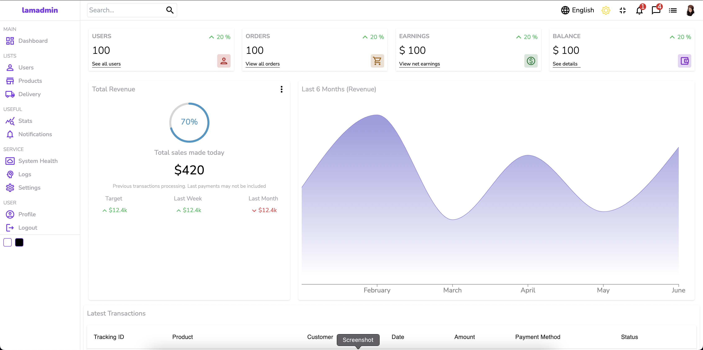
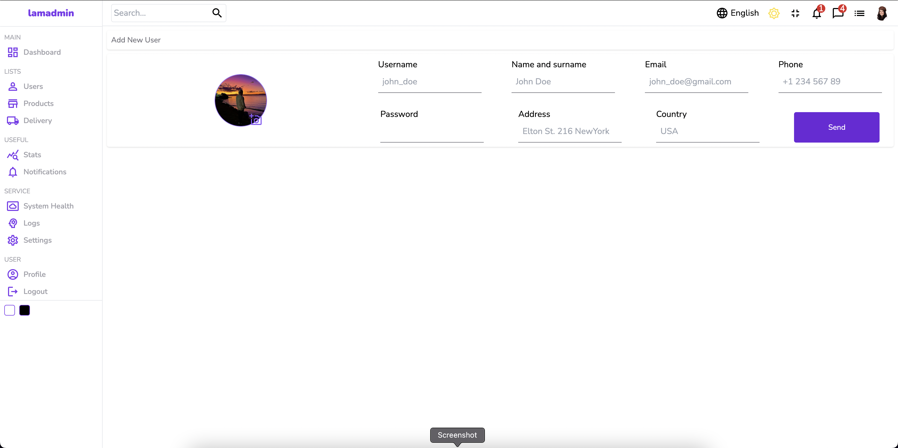
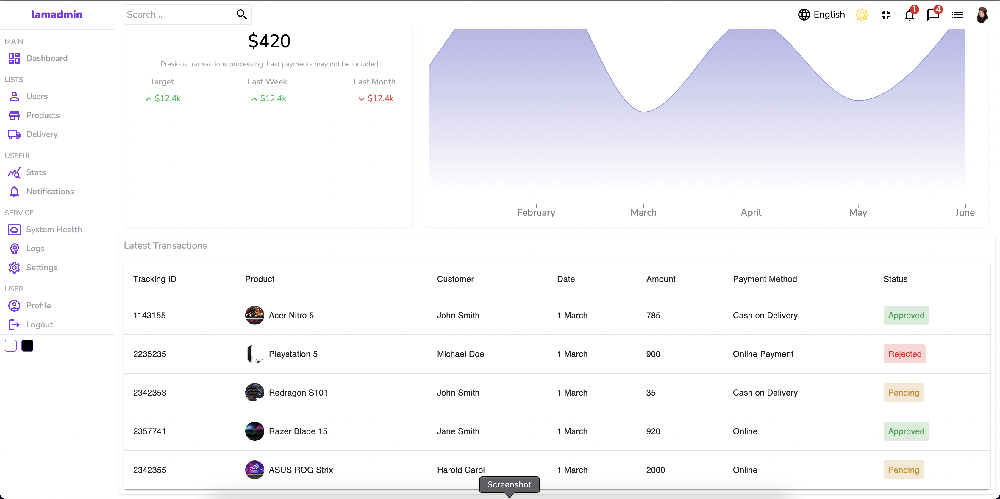
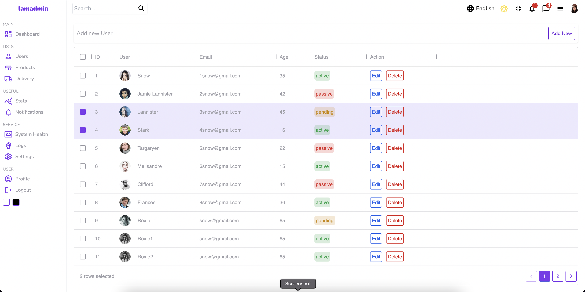

   
  <h1>Admin Dashboard</h1>

- [ ] - dark mode (processing)
- [ ] - login page
- [ ] - consume an API

  <a href="#rocket-technologies">Technologies</a>

   
  
  
  

---

## :rocket: Technologies

- [React](https://reactjs.org/)
- [Typescript](https://www.typescriptlang.org)
- [tailwind](https://tailwindcss.com/)
- [Material UI](https://mui.com/)

---

Made with ♥ by Lucas Aguiar :wave: [Get in touch!](https://www.linkedin.com/in/lucasaguiiar)
